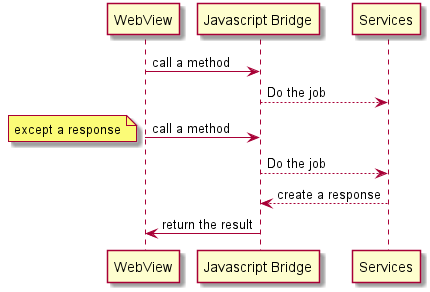
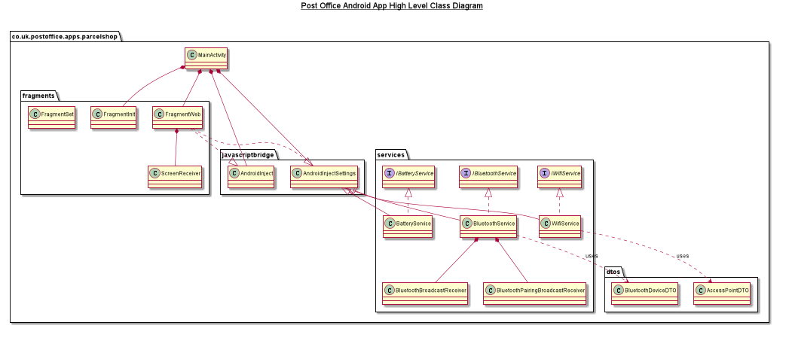
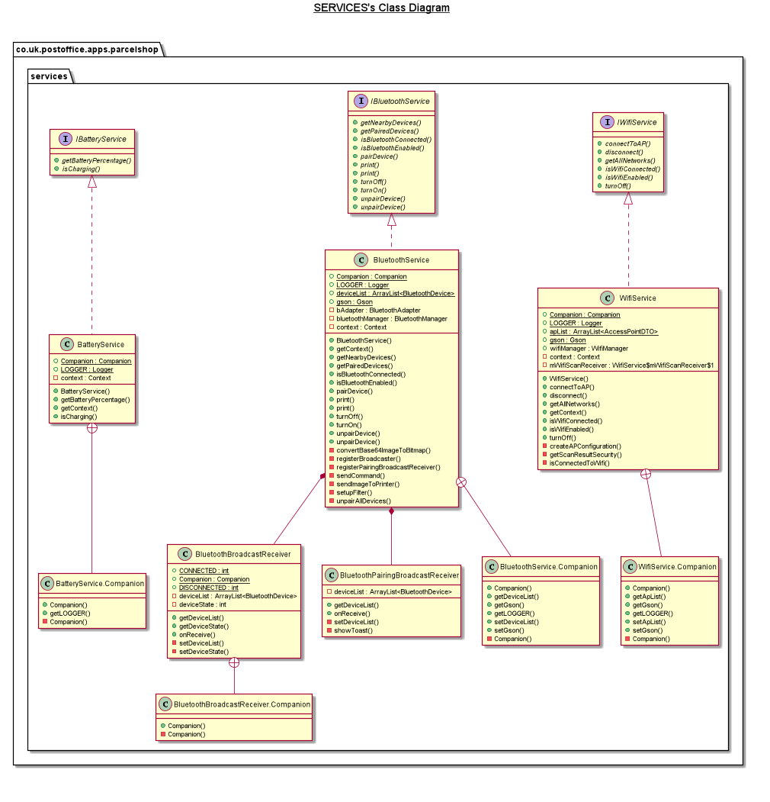

# Post office Android Application
This repository contains the latest source code of Post office Android Application. It is mainly developed using **Android Studio**, **Kotlin** and **Gradle** . Please follow the instructions below to build and deploy on your device.

## Build Tools Required
1. Android Studio (Version:3.0.1 or higher) 
2. Android SDK, <a href="https://developer.android.com/sdk/index.html#Other"> Download </a>
3. Gradle, <a href="https://gradle.org">Download </a> and make sure it is in your executable PATH.  
4. Kotlin, <a href="https://kotlinlang.org">Kotlin Programming Language</a>
5. Java 8, <a href="http://www.oracle.com/index.html">Download</a> and make sure you have set JAVA_HOME environment variable pointing to JDK.

## Building
The application can be built either by using build menu **Build -> Build APK(s)** in Android Studio or from a terminal using **gradle** as **gradle assembleDebug** for a debug version or **gradle assembleRelease** for a release version of this application. The resultant APK can be found in **app/build/outputs/apk/debug** for a debug built and **app/build/outputs/apk/release** for release built accordingly.\
If you have any problem in compiling the code for debug version, comment out **signingConfigs** sections in the app **gradle** file temporarily and then try to compile.

## Version naming rules
Semantic versioning is being used for giving version to the release and hotfix branches. Each version contains three version numbers − Major.Minor.Patch.
- Here’s what each of them means:
  - Major − code is incompatible or contains significant changes
  - Minor − code has been changed but the changes are backwards compatible
  - Patch − bug fixes have been made

## Interfaces
There are two interfaces exposed for the WebView.

* **androidInjectSetting**\
    1- **getBluetoothPairedDevices()** returns ***string***
    ```json
    [
        {
            "address": "34:80:F4:4D:3B:56",
            "name": "ZEBRA ZQ220"
        }
    ]
    ```
    2- **getBluetoothPairedDevicesAsync()** returns ***JSPromise***\
    The output is similar to _getBluetoothPairedDevices()_  and this is how you can use it in javascript.
    ```javascript
    var pairedDevices = window.androidInjectSetting.getBluetoothPairedDevicesAsync();

    pairedDevices.then = function(callback){
        var name = "callback_"+Math.floor((Math.random() * 100000));
        window[name] = callback
        return pairedDevices.thenJS(name);
    }
    
    pairedDevices.then(function(a){
        console.log("CALLBACK in JAVASCRIPT "+JSON.stringify(a));
    });
    ```
    3- **getBluetoothNearbyDevices()** returns ***string***
    ```json
    [
        {
            "address": "34:80:F4:4D:2D:56",
            "name": "STAR L200-03033"
        },
        {
            "address": "34:80:F4:4D:3B:56",
            "name": "STAR L300-02044"
        }
    ]
    ```
    4- **getBluetoothNearbyDevicesAsync()** returns ***JSPromise***\
    The output is similar to _getBluetoothNearbyDevices()_  and this is how you can use it in javascript.
    ```javascript
    var neabyDevices = window.androidInjectSetting.getBluetoothNearbyDevicesAsync();

    neabyDevices.then = function(callback){
        var name = "callback_"+Math.floor((Math.random() * 100000));
        window[name] = callback
        return neabyDevices.thenJS(name);
    }
    
    neabyDevices.then(function(a){
        console.log("CALLBACK in JAVASCRIPT "+JSON.stringify(a));
    });
    ```
    5- **turnOffBluetooth(address: String)**\
    6- **unpairBluetoothDevice(address: String)**\
    7- **unpairBluetoothDevice**\
    8- **printWithBluetoothPrinter(address: String, base64Image: String)**\
    9- **printWithBluetoothPrinter(base64Image: String)**\
    10- **isBluetoothPrinterConnected()** returns ***Boolean***\
    11- **isBluetoothPrinterConnectedAsync()** returns ***JSPromise***\
    The output is similar to _isBluetoothPrinterConnected()_  and this is how you can use it in javascript.
    ```javascript
    var isPrinterConnected = window.androidInjectSetting.isBluetoothPrinterConnectedAsync();

    isPrinterConnected.then = function(callback){
        var name = "callback_"+Math.floor((Math.random() * 100000));
        window[name] = callback
        return isPrinterConnected.thenJS(name);
    }
    
    isPrinterConnected.then(function(a){
        console.log("CALLBACK in JAVASCRIPT "+JSON.stringify(a));
    });
    ```
    12- **getWifiNetworks()** returns ***String***
    ```json
    [
        {
            "capabilities": "[WPA2-PSK-CCMP][ESS]",
            "ssid": "Connectify-GP",
            "isConnected": true
        },
        {
            "capabilities": "[WPA2-PSK-CCMP][ESS]",
            "ssid": "GeeksGuest",
            "isConnected": false
        }
    ]
    ```
    13- **getWifiNetworksAsync()** returns ***JSPromise***\
    The output is similar to _getWifiNetworks()_  and this is how you can use it in javascript.
    ```javascript
    var wifiNetworks = window.androidInjectSetting.getWifiNetworksAsync();

    wifiNetworks.then = function(callback){
        var name = "callback_"+Math.floor((Math.random() * 100000));
        window[name] = callback
        return wifiNetworks.thenJS(name);
    }
    
    wifiNetworks.then(function(a){
        console.log("CALLBACK in JAVASCRIPT "+JSON.stringify(a));
    });
    ```
    14- **turnOffWifi()**\
    15- **disconnectWifi()**\
    16- **connectToWifi(networkSSID: String, networkPassKey: String)** returns ***Boolean**\
    17- **connectToWifiAsync(networkSSID: String, networkPassKey: String)** returns ***JSPromise**\
    The output is similar to _connectToWifi()_  and this is how you can use it in javascript.
    ```javascript
    var connectToWifi = window.androidInjectSetting.connectToWifiAsync();

    connectToWifi.then = function(callback){
        var name = "callback_"+Math.floor((Math.random() * 100000));
        window[name] = callback
        return connectToWifi.thenJS(name);
    }
    
    connectToWifi.then(function(a){
        console.log("CALLBACK in JAVASCRIPT "+JSON.stringify(a));
    });
    ```
    18- **isWifiEnabled()** returns ***Boolean***\
    19- **isWifiEnabledAsync()** returns ***JSPromise***\
    The output is similar to _connectToWifi()_  and this is how you can use it in javascript.
    ```javascript
    var isWifiEnabled = window.androidInjectSetting.isWifiEnabledAsync();

    isWifiEnabled.then = function(callback){
        var name = "callback_"+Math.floor((Math.random() * 100000));
        window[name] = callback
        return isWifiEnabled.thenJS(name);
    }
    
    isWifiEnabled.then(function(a){
        console.log("CALLBACK in JAVASCRIPT "+JSON.stringify(a));
    });
    ```
    20- **isWifiConnected()** returns ***Boolean***\
    21- **isWifiConnectedAsync()** returns ***JSPromise***\
    The output is similar to _connectToWifi()_  and this is how you can use it in javascript.
    ```javascript
    var isWifiConnected = window.androidInjectSetting.isWifiConnectedAsync();

    isWifiConnected.then = function(callback){
        var name = "callback_"+Math.floor((Math.random() * 100000));
        window[name] = callback
        return isWifiConnected.thenJS(name);
    }
    
    isWifiConnected.then(function(a){
        console.log("CALLBACK in JAVASCRIPT "+JSON.stringify(a));
    });
    ```
    22- **getBrightness()** returns ***Int***\
    Brightness value is from 0 to 100\
    23- **setBrightness(brightness: Int)**\
    Brightness value is from 0 to 100\
    24- **getSystemVolume()** returns ***Int***\
    Volume value is between 1 to 15\
    25- **setSystemVolume(volume: Int)**\
    Volume value is between 1 to 15\
    26- **getBatteryPercentage()** returns ***Int***\
    Battery value is between 0 to 100\
    27- **getBatteryPercentageWithChargingState()** returns ***JSPromise***\
    Battery value is between 0 to 100
    ```javascript
        var result = window.androidInjectSetting.getBatteryPercentageWithChargingState();
        result.then = function(callback){
            var name = "callback_"+Math.floor((Math.random() * 100000));
            window[name] = callback
            return result.thenJS(name);
        }
        result.then(function(a){
            var json = JSON.parse(a)
            console.log("Battery: " + json.percentage +"% and is Charging " + json.isCharging );
        });
    ```
    28- **getDeviceSerialNumber()** ***String***

* **androidInject**\
    1- **showToast(message:String)**\
    2- **getCertificate()** returns ***String?***\
    returns a base64 version of certificate\
    3- **getKey()** returns ***String?***\
    returns a base64 version of the key\
    4- **printIt(base64:String)**\
    print a base64 PNG image with the device thermal printer\
    5- **startApp(name:String)**\
    This function facilitate to trigger other application such as android system settings , xaioutility and production test.\
    Accepted values are _android_settings_, _com.android.settings_, _xac_xaioutility_, _com.xac.util.saioutility_, _xac_productiontest_, _com.xac.productiontest_


## Sequence Diagram
Here is a generic sequence diagram:\
    
    
    
## Application Class Diagram
The high view of classes and how they are structured.\
    
    
### Services Class Diagram
The services class diagram in more details.\
    
    
## Release Notes
### 1.3.12
19/11/2019

* Fix the issue that pushes the printed label out of printable area
* 122613: Fix multiple returns CoPs not printed
* Disable always on screen functionality